# 命令列

電影裡的電腦高手總是盯著一個黑黑的螢幕，然後在鍵盤上敲敲敲，就說自己完成了一些很厲害的事情。為什麼他們的電腦上明明沒有畫面，卻還能做事？其實電腦上當然還是有東西，只是電腦高手用的**命令列介面（command line interface）**和我們平常習慣的**圖形用戶介面**不太一樣。

我們寫程式的時候，常常也要用到這個命令列介面。所以本節就是要教你使用這個很厲害的介面；看完這一章後，你用起電腦也會和電影上一樣架勢十足，怎麼看都是高手！不過別擔心，雖然它看起來很嚇人，但其實並沒那麼難，只是「不一樣」而已。只要記住一些基本知識，就不至於在裡面迷路。

## 終端機、Prompt、路徑

要進入命令列，就必須使用「終端機」。如果你已經走過[安裝開發環境](/tutorials/installation/)，應該已經知道怎麼打開它了。我們之前提過，在終端機打開時會出現一個 *prompt*，而且在它後面會有一個閃閃閃的符號（它叫**游標**），代表你現在可以打東西進去，命令電腦做事情。但這個 prompt 本身究竟有什麼意義呢？

((( windows

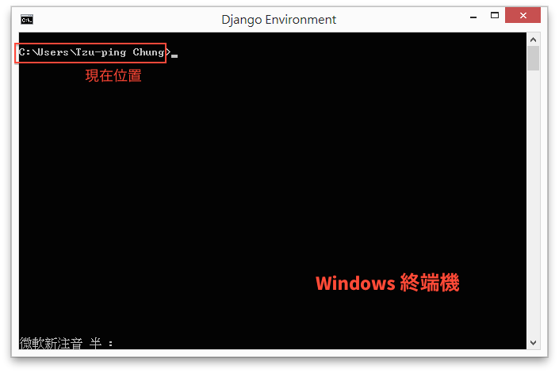

在 Windows 上，prompt 應該會顯示 `系統磁碟:\Users\你的名字>`。最後的三角形（`>`）不重要，前面則是「現在位置」，在這個例子中就是 `C:\Users\Tzu-ping Chung`。這串東西叫作**路徑**，是用來表示某個東西在電腦裡的位置；其中反斜線（`\`）代表**目錄**，或者你可能比較習慣叫它「資料夾」。路徑最後面的斜線可以省略，所以這個 prompt 代表你現在在 **C 槽裡面的 Users 目錄裡面的 Tzu-ping Chung 目錄**裡面。這在 Windows（Vista 以上）是用來存放某個使用者（在這裡就是 `Tzu-ping Chung`）的個人檔案，也有人把它叫做「家」目錄。

)))

((( osx

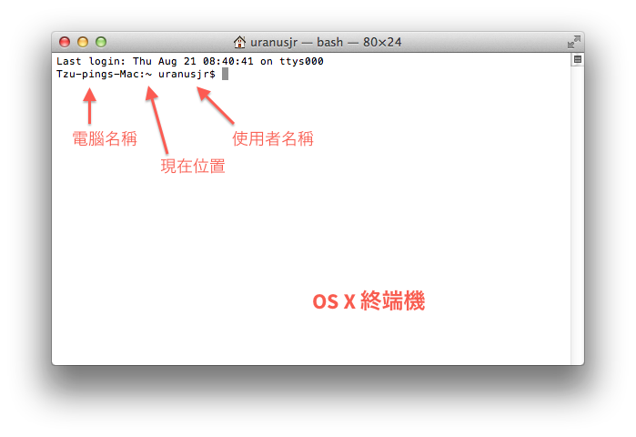

在 OS X 上，prompt 會顯示 `電腦名稱:現在位置 使用者名稱$` 這種格式。我們通常只關心「現在位置」的部分。在終端機裡，是用**路徑**來表示某個東西在電腦裡的位置。現在看到的 `~` 符號是一個特殊記號，代表你現在在「家」裡面。我們可以用 `pwd` 這個命令，來獲得我們目前的真正位置。輸入 `pwd` 並按 Return，你的終端機裡面應該會變成類似這樣：

```
uranusjr:~ uranusjr$ pwd
/Users/uranusjr
uranusjr:~ uranusjr$
```

電腦對你的 `pwd` 指令回答了你現在的位置，然後又讓你回到 prompt。所以我們現在在 `/Users/uranusjr`。這也是**路徑**，其中斜線（`/`）代表**目錄**，或者你可能比較習慣叫它「資料夾」。路徑最後面的斜線可以省略，所以這個 prompt 代表你現在的位置在 **Users 目錄裡面的 uranusjr 目錄**。

在命令列裡和在圖形介面不同，你沒辦法隨時看到自己現在究竟在哪裡。所以 `pwd` 這個指令十分好用。它就像 GPS——當你不知道自己在哪裡時，就問它吧！

)))

((( linux

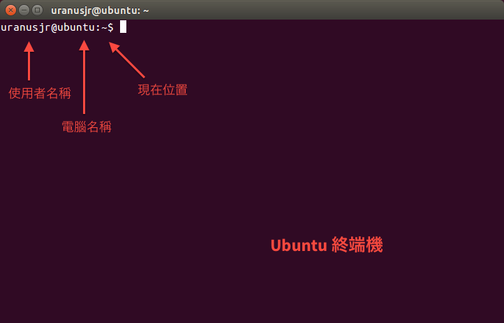

在 Ubuntu 上，prompt 會顯示 `使用者名稱@電腦名稱:現在位置$` 這種格式。我們通常只關心「現在位置」的部分。在終端機裡，是用**路徑**來表示某個東西在電腦裡的位置。現在看到的 `~` 符號是一個特殊記號，代表你現在在「家」裡面。我們可以用 `pwd` 這個命令，來獲得我們目前的真正位置。輸入 `pwd` 並按 Return，你的終端機裡面應該會變成類似這樣：

```
uranusjr@ubnutu:~$ pwd
/home/uranusjr
uranusjr@ubnutu:~$
```

電腦對你的 `pwd` 指令回答了你現在的位置，然後又讓你回到 prompt。所以我們現在在 `/home/uranusjr`。這也是路徑，其中斜線（`/`）代表**目錄**，或者你可能比較習慣叫它「資料夾」。路徑最後面的斜線可以省略，所以這個 prompt 代表你現在的位置在 **home 目錄裡面的 uranusjr 目錄**。

在命令列裡和在圖形介面不同，你沒辦法隨時看到自己現在究竟在哪裡。所以 `pwd` 這個指令十分好用。它就像 GPS——當你不知道自己在哪裡時，就問它吧！

)))

## 建立目錄、列出目錄內容

你可以在終端機裡達成所有平常圖形介面辦得到的事——建立目錄、進入目錄、退出目錄（也就是「回到上一層」）、刪除檔案與目錄等等。這有點像施魔法：你在 prompt 後面下一個咒語（常用的術語是**下指令**），就可以讓電腦產生變化。

試著輸入這個咒語… 我是說指令：

```console
mkdir bedroom
```

`mkdir` 是用來建立一個目錄；後面的 `bedroom` 是用來指定目錄的名稱。所以這整句的意思就是「電腦，建立一個叫 `bedroom` 的目錄」。它會在我們的「家」裡面建立一個臥室。

現在按 Enter（在 Mac 上是 Return），代表把咒語放出去。，電腦馬上又回你一個 prompt，好像什麼事都沒有發生耶！

其實這很正常。命令列和圖形介面的習慣不同：在命令列中，「什麼事情都沒發生」通常是代表指令成功；反而是當指令失敗時，電腦才會向你抱怨。在命令列中，沒有消息就是好消息。

不過口說無憑，我們還是希望看到點證據。所以我們現在要用另一個指令，來檢查剛剛的目錄有沒有建成功：

```console
ls
---windows
dir /w
```

這是用來檢視目前位置中有哪些東西。結果應該會類似這樣：

((( windows
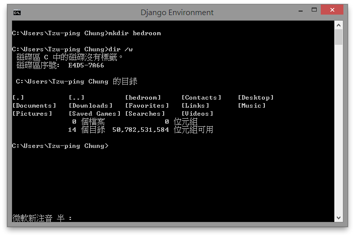
)))

((( osx
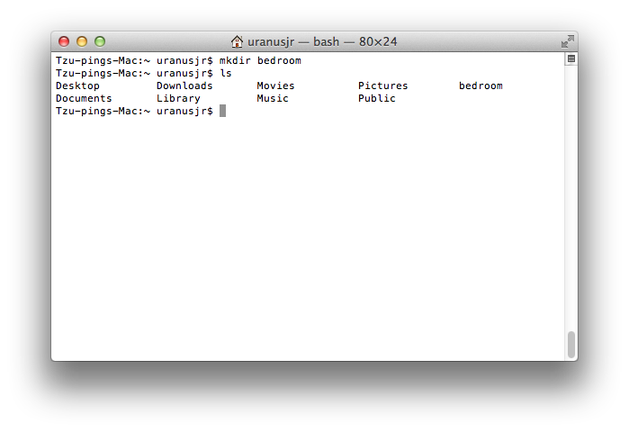
)))

((( linux
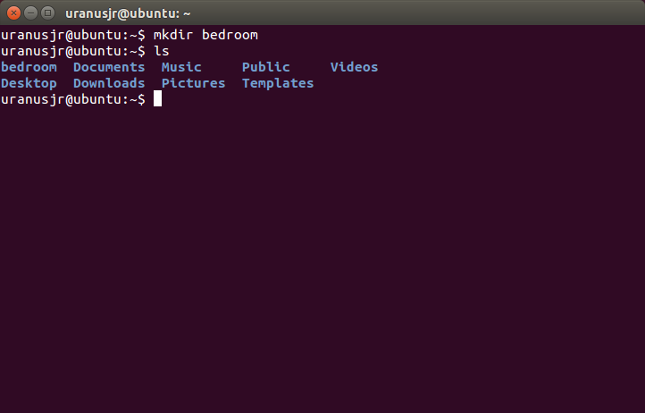
)))

看到 `bedroom` 了嗎？那就是我們剛剛建立的目錄。

((( windows
我們也看到一堆其他作業系統產生的目錄，以及… 咦，`.` 和 `..`？我們的家目錄沒有這兩個東西吧？

先別擔心，我們之後會告訴你它們的真面目。
)))

在命令列中建立目錄和你平常在視窗裡建立新檔案夾其實是同一件事。所以如果你打開瀏覽視窗，也同樣可以看到剛剛建立的 `bedroom`：

((( windows
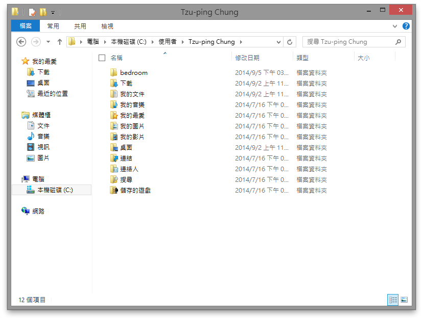
)))

((( osx
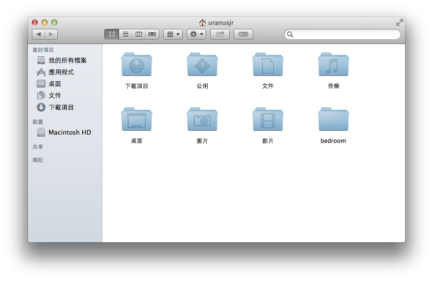
)))

((( linux
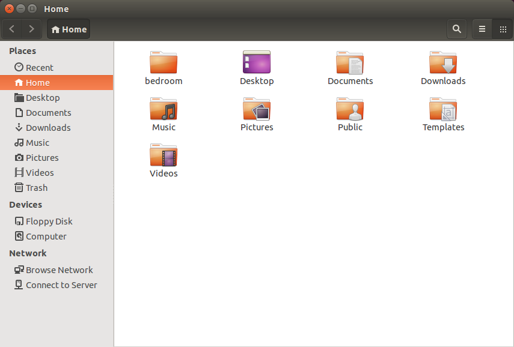
)))

試著在 `bedroom` 旁邊建立一個新檔案 `table`：

((( windows
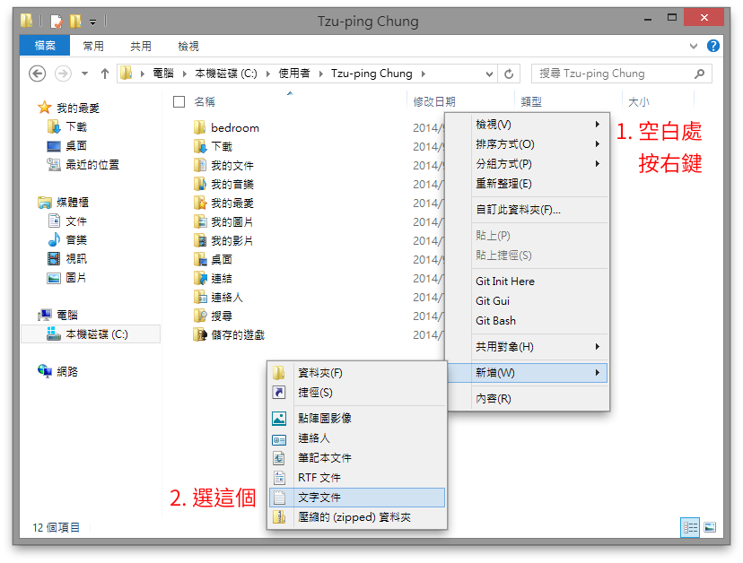

)))

((( osx

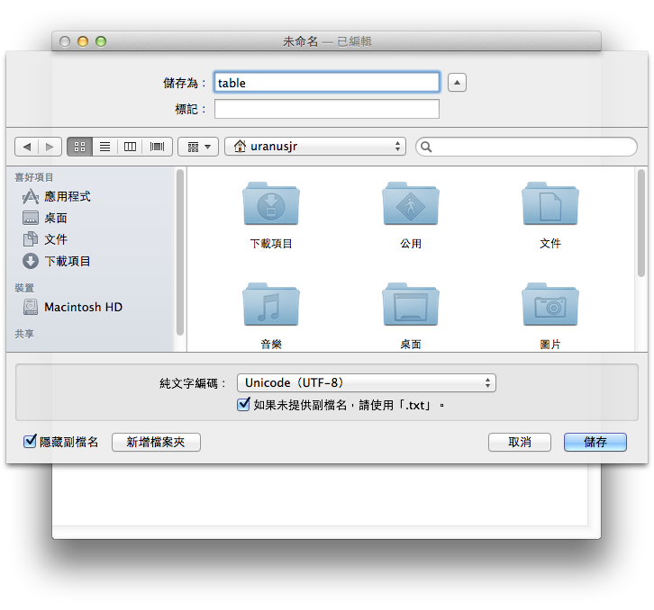

（我這裡用的是內建的**文字編輯.app**。你可以使用任何你慣用的程式，只要在家目錄存一個叫 `table.txt` 的檔案就好了！

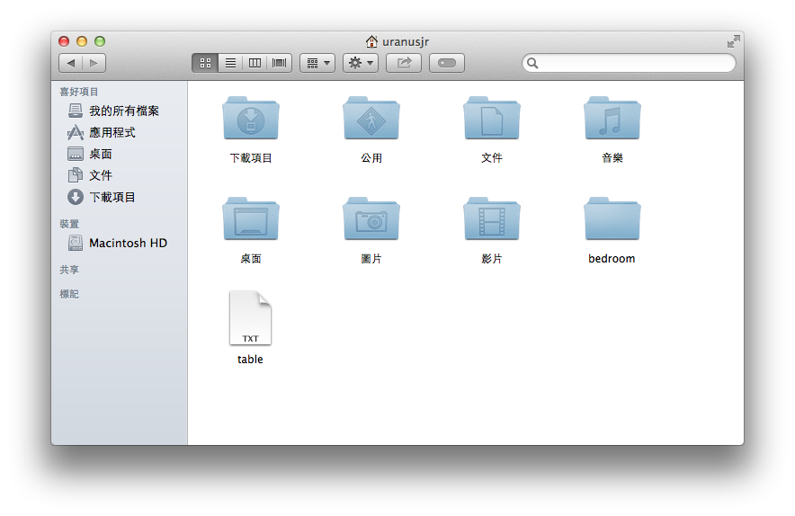

)))

((( linux
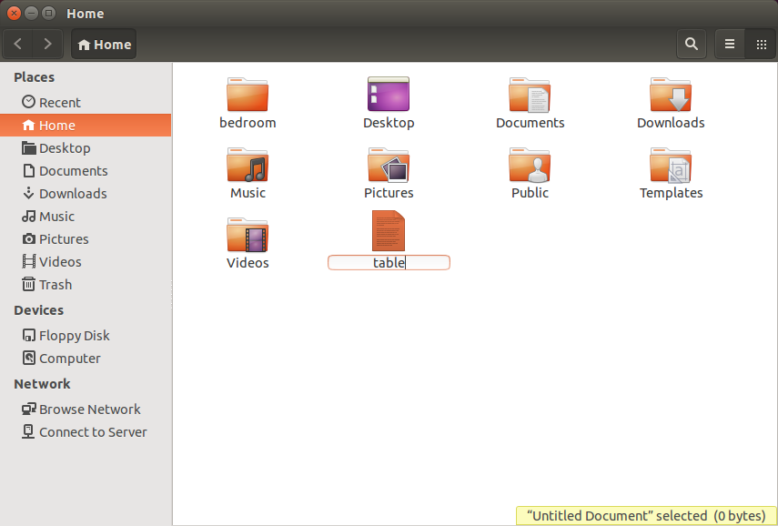
)))

然後回到命令列檢查：

```console
ls
---windows
dir /w
```

確實多了一張桌子！


## 在目錄間移動

我們來試著進入剛剛建立的 `bedroom` 目錄。輸入以下的指令：

```console
cd bedroom
```

然後檢查現在的位置，確認它有改變。

我們在裡面建立一個目錄：

```console
mkdir closet
```

這會在你的臥室裡建立一個衣櫃（`closet`）。

我現在想進去衣櫃裡面。知道要用什麼指令嗎？

```console
cd closet
```

就是這樣！不過衣櫃裡不太舒服，所以別在裡面呆太久。輸入以下的指令，回到家目錄：

```console
cd ../..
---windows
cd ..\..
```

嗯，舒服多了。不過 `..` 是什麼東西！？

### 絕對路徑與相對路徑

我們先回頭討論一下**路徑**這個主題。之前已經有稍微解釋過路徑的概念，不過它其實還可以分成兩種：**絕對**和**相對**路徑。

如果把路徑想成地址，那麼絕對路徑與相對路徑就分別相當於你寄信用的住址，以及平常聊天時會用到的地址。它們都代表一個東西的位置，但是根據用途不同，表現方式就會不太一樣。在寫信時，我們必須要寫出完整的地址，否則郵差沒辦法知道怎麼送；這個住址可以在所有情況下通用，所以是「絕對」的。但平常在聊天時，我們就可以根據現在所在的位置，省略一些不必要的部分，甚至乾脆直接說「樓上」或者「隔壁」，連名稱都省了；這個位置必須要考慮我們講話時的位置，所以是「相對」的。

路徑也是一樣。當我們把檔案的完整路徑寫出來時，就是絕對路徑；根據目前所在位置來簡化的路徑，就是相對路徑。

我們從衣櫥出來之後，現在位置應該會類似這樣：

```console
C:\Users\Tzu-ping Chung
---osx
/Users/uranusjr
---linux
/home/uranusjr
```

((( windows
這就是絕對路徑。它一定會以磁碟名稱開頭，後面加上一個冒號與反斜線，例如本例的 `C:\`。
)))

((( osx linux
這就是絕對路徑。它一定會以一個斜線 `/` 開頭。
)))

下面則是相對路徑的例子：

((( windows
```console
bedroom\closet
```

相對路徑不會包含磁碟名稱，只會包含目錄名稱與反斜線。
)))

((( osx linux
```console
bedroom/closet
```

相對路徑的開頭沒有斜線。
)))

當看到相對路徑時，必須考慮我們目前所處的位置。上面的相對路徑，實際上就代表「從現在的位置，進入 `bedroom` 目錄，再進入 `closet` 目錄」。我們現在在家目錄，所以它等同於這個絕對路徑：

```console
/home/uranusjr/bedroom/closet
---osx
/Users/uranusjr/bedroom/closet
---windows
C:\Tzu-ping Chung\bedroom\closet
```

### 「外面」

相對路徑除了可以用斜線與名稱外，還可以用一些特殊符號來輔助。例如前面看到的 `..`，意思其實就是（現在位置的）「外面那個目錄」。我們在衣櫥裡時，絕對路徑是

```console
/home/uranusjr/bedroom/closet
---osx
/Users/uranusjr/bedroom/closet
---windows
C:\Tzu-ping Chung\bedroom\closet
```

當我們輸入下面的指令：

```console
cd ../..
---windows
cd ..\..
```

其實就代表我們想去「（衣櫥的）外面的外面」。衣櫥的外面是臥室，臥室的外面是家目錄。所以上面指令的意思其實就是「讓我回到家目錄」囉。


## 拷貝

你有一個朋友想在你家借住一晚。可是我們現在只有一間臥室——你自己要住的。所以我們現在要幫這位朋友蓋一間客房，叫做 `guestroom` 。

當然，你也可以把上面的步驟重複一次，只是把 `bedroom` 改成 `guestroom`。但是你想要讓客房和你的臥室一模一樣，那麼直接把臥室拷貝（copy）一份會比較快。（這畢竟不是真實世界。）

你可以在家目錄用下面的指令來把 `bedroom` 拷貝到 `guestroom`：

```console
cp bedroom guestroom
---windows
xcopy /e bedroom guestroom
```

這會把 `bedroom` 與它裡面的所有東西都複製一份，放到 `guestroom`。我們檢查一下有沒有成功：

```console
ls
---windows
dir /w
```

是不是多一個 `guestroom` 了？進去檢查一下，裡面是不是真的和 `bedroom` 一樣有附衣櫃：

```console
cd guestroom
ls
---windows
cd guestroom
dir /w
```

有吧！接著再退出客房，回到家目錄：

```console
cd ..
```

## 移動與重新命名

你和朋友玩得很高興。但過了幾天之後，朋友回家，客房就空出來了。放著積灰塵也不好，我們來把它改裝成客廳吧！（這真的不是現實世界。）

首先我們要把房間名字改掉。在命令列中，改名字與移動是一樣的概念，使用的指令也相同。在家目錄中使用下面的指令，就可以把 `guestroom` 改成 `living-room`：

```console
mv guestroom living-room
---windows
move guestroom living-room
```

確認一下是不是有成功。現在家目錄裡應該會有 `bedroom` 與 `living-room` 兩個房間（還有一些其他目錄，不過我們不管它們）。

客廳裡擺衣櫥好像怪怪的。我們來把它搬到自己房間。噢不過房間裡已經有一個衣櫃，所以這個就叫 `closet2` 好了。所以指令會像下面這樣：

```console
mv living-room/closet bedroom/closet2
---windows
move living-room\closet bedroom\closet2
```

我們用了相對路徑，只靠一個指令就直接把 `living-room` 裡的 `closet` 搬到 `bedroom`，還順便把名稱改成 `closet2`！


## 總結

命令列的教學就到這裡。恭喜你！只要勤加練習，把指令記熟，你也可以有電腦高手的架勢！

噢對了，我們應該順手把剛剛練習的目錄清理掉。用下面的指令，就可以把我們剛剛建立過的東西刪除：

```console
rm table
rm -r bedroom
rm -r living-room
---osx
rm table.txt
rm -r bedroom
rm -r living-room
---windows
del table.txt
rmdir /s bedroom
rmdir /s living-room
```

(((windows

輸入指令後，會跳出一個「您確定要執行嗎 (Y/N)？」的提示。請輸入 `y`（大小寫都可以），然後按 Enter，確定刪除。

在命令列內，刪除檔案的指令是 `del` 後面接檔案路徑。不過我們這裡是要刪除目錄，所以用的是 `rmdir`。但是 `rmdir` 有個限制：目錄裡面不能有東西。我們的 `bedroom` 裡有兩個衣櫃，所以要使用 `rmdir /s`，代表「不管裡面有沒有東西，全部刪掉就對了」！

)))

((( osx linux
在命令列內，刪除檔案的指令是 `rm` 後面接檔案路徑。刪除目錄時，則必須使用 `rm -r`，告訴電腦「這個目錄和它裡面的東西都要刪掉」！
)))

**注意：**命令列內沒有「資源回收桶」（或叫「垃圾桶」）的概念，當刪除檔案時，就真的是刪除，完全、永遠、再也看不見了！所以在下這個指令之前，請千萬要好好想清楚喔！

好啦，這次是真的結束了！下面是本教學裡面所有的指令。如果你之後需要複習，可以看這個表格，比較方便！

(((linux osx

 動作           | 指令語法  | 備註
---------------|----------|---------
列出現在位置內容  | `ls` |
列出目錄內容     | `ls <目錄路徑>` |
進入目錄        | `cd <目錄路徑>` | 回上一層：`cd ..`。
建立目錄        | `mkdir <目錄路徑>` |
拷貝項目        | `cp <項目路徑> <目標路徑>` | 可以拷貝檔案或目錄。
移動項目        | `mv <項目路徑> <目標路徑>` | 也可以拿來重新命名項目。
刪除檔案        | `rm <檔案路徑>` | 刪除之後就回不去了！
刪除目錄        | `rm -r <目錄路徑>` | 刪除之後就回不去了！

)))

(((windows

 動作           | 指令語法  | 備註
---------------|----------|---------
列出現在位置內容  | `dir /w` |
列出目錄內容     | `dir /w <目錄路徑>` |
進入目錄        | `cd <目錄路徑>` | 回上一層：`cd ..`。
建立目錄        | `mkdir <目錄路徑>` |
拷貝項目        | `xcopy /e <項目路徑> <目標路徑>` | 可以拷貝檔案或目錄。
移動項目        | `move <項目路徑> <目標路徑>` | 也可以拿來重新命名項目。
刪除檔案        | `del <檔案路徑>` | 刪除之後就回不去了！
刪除目錄        | `rmdir /s <目錄路徑>` | 刪除之後就回不去了！

)))