本節將引導你安裝並設定專案所需要的環境。我們會進行以下的步驟：

1. 安裝 Git。
2. 安裝 Python 3.4。

((( windows

### 安裝 Git

首先下載[最新版本的 Git](http://git-scm.com/download/win)，並雙擊下載後的安裝檔開始安裝。程式可能會先跳出要求管理員權限的視窗：

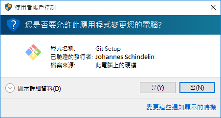

請按「是」。

接著你應該會看到這個畫面：

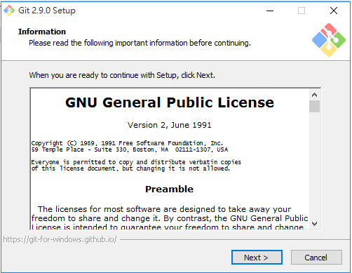

請持續按下一步，直到出現這個畫面：

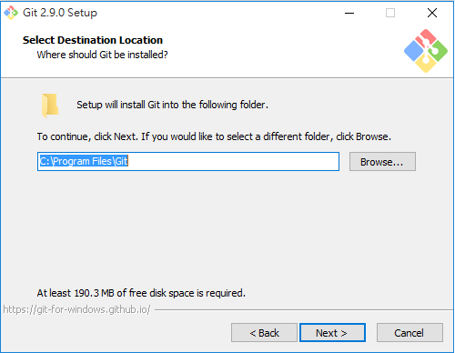

請打開記事本，把文字框裡的內容記下來。我們之後會用到。（不要照抄這篇文章裡的內容，因為你的電腦上可能會不一樣。請從你自己電腦上出現的文字框拷貝！）

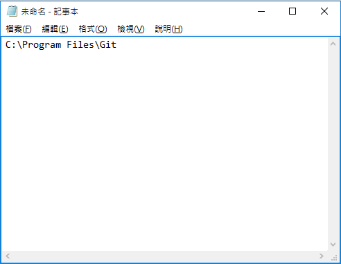

接著回到安裝程式，繼續按下一步，直到它開始安裝。直到出現這個畫面，就代表安裝完成。

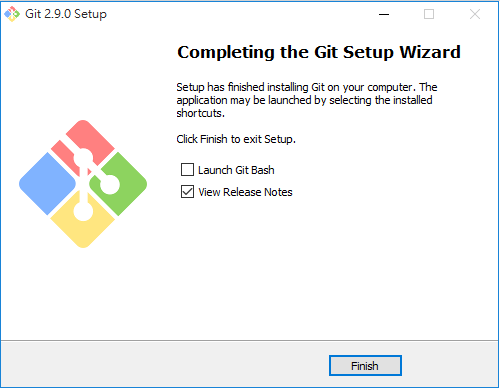

先別急著按 Finish！中間有個「View ReleaseNotes.rtf」先取消打勾，再按 Finish 關掉視窗。如果你忘了取消，就會再另外跳一個視窗出來——也別緊張，關掉它就好了，不會怎樣。

### 安裝 Python

首先[下載 Python 3.4.1](http://www.python.org/ftp/python/3.4.1/python-3.4.1.msi)。雙擊下載後的安裝檔，你應該會看到這個畫面

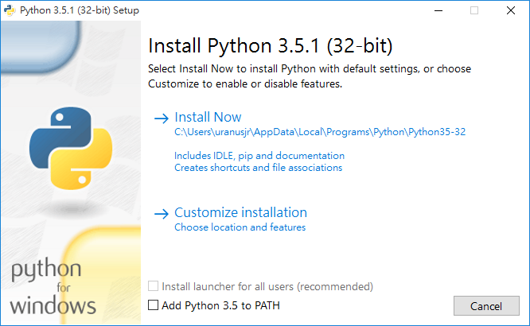

請按下一步。現在應該會出現這個畫面：

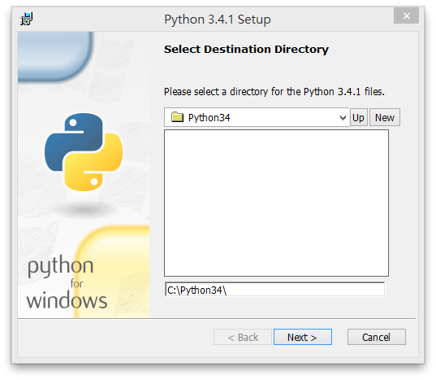

請把最畫面文字框內的文字同樣記到記事本裡。現在你的記事本應該會長這樣：

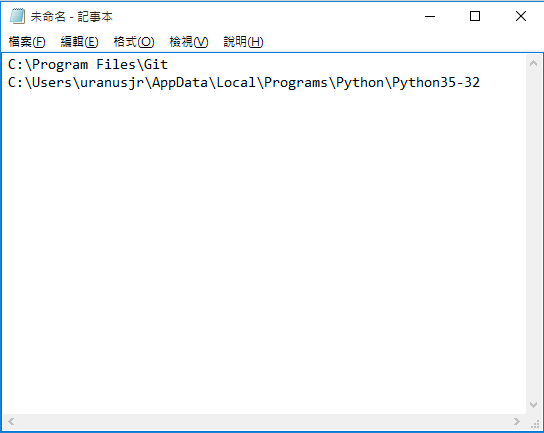

回到安裝程式，再按一次下一步。應該會出現這個畫面：


確認**只有最後一個選項**打叉，按下一步開始安裝。安裝程式可能會要求管理員權限，請在提示視窗中確認。稍等一會兒，直到出現這個畫面

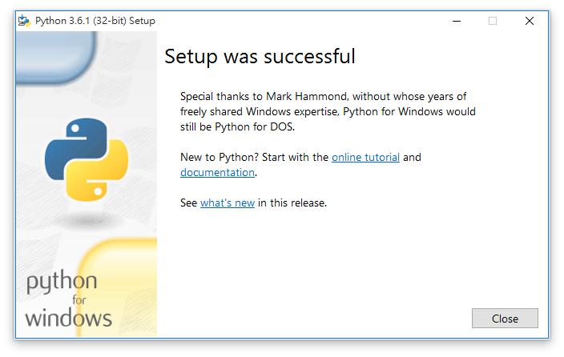

就代表安裝完成了！

### 建立開發用捷徑

接著請下載[這個檔案](http://d.pr/f/RS9L)，然後按兩下執行它。還記得剛剛我們在記事本寫的那兩行嗎？請依序把它們拷貝起來，在出現的黑色視窗裡**按右鍵選擇貼上**，然後按 Enter。結果應該會像這樣：

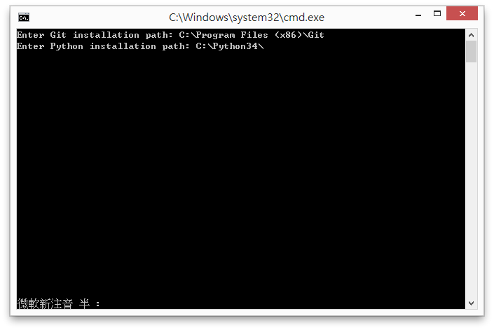

當你按下第二次 Enter 後，視窗會關閉。然後你的桌面應該會出現一個叫做「Django Environment」的捷徑。

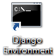

雙擊打開它。你應該會看到這樣的畫面：

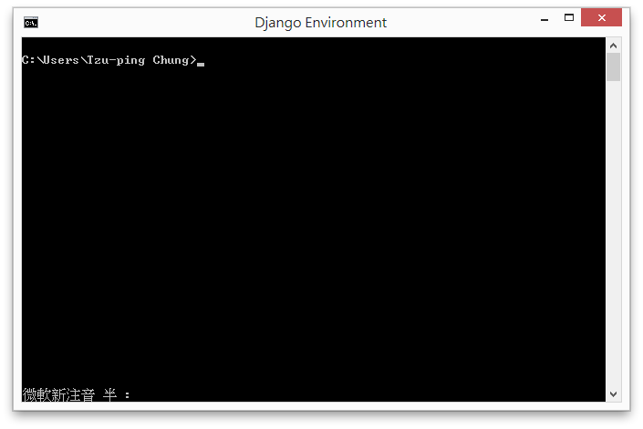

出現的這行字叫做 *prompt*。當它出現時（結尾會是一個 `>` 符號），代表終端機已經完成所有的工作，準備好等你輸入下一個指令。

我們首先設定你的名字和 email：

```console
git config --global user.name "你的名字"
git config --global user.email "你的 email"
```

不需要用真名，取個看得懂的代號就好。我們建議在名字只使用英文與數字，雖然如果你硬要用中文，通常也可以。Email 當然就是填可以用的信箱。

接著輸入 `python` 看看。你應該會看到類似下面的畫面：

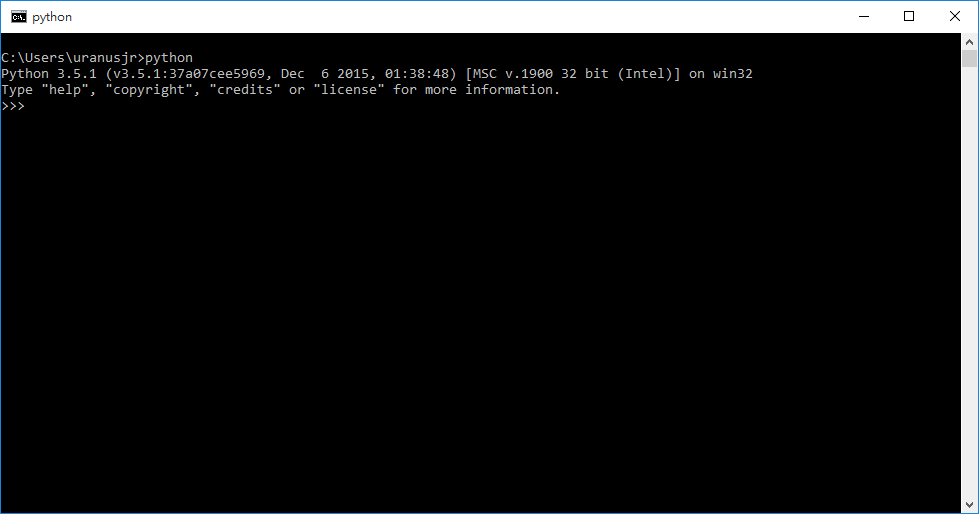

你可以直接關掉這個視窗。未來當我們說「打開終端機」時，就代表你需要用這個「Django Environment」捷徑打開視窗來使用。

恭喜安裝成功！

)))

((( osx

### 安裝 Homebrew

我們推薦使用 [Homebrew](http://brew.sh) 安裝需要的工具。首先，按下螢幕右上角的放大鏡（它叫 Spotlight），並輸入「終端機」（英文：Terminal），像這樣：

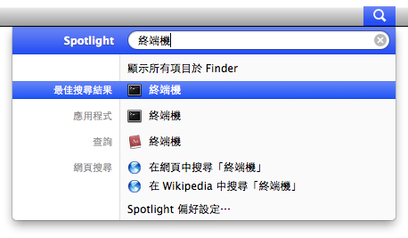

點一下第一個結果，應該會出現類似這樣的視窗：

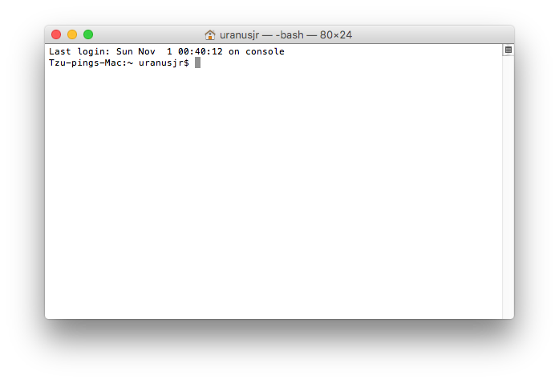

未來當我們說「打開終端機」時，就代表你需要打開一個這樣的視窗。你可能會想要把這個程式固定到 Dock 上，方便未來開啟。

注意畫面上的最後一行字。這行字叫做 *prompt*。當它出現時（結尾會是一個 `$` 符號），代表終端機已經完成所有的工作，準備好等你輸入下一個指令。

拷貝下面的指令，貼到終端機視窗內，並按下 Return 執行它：

```bash
ruby -e "$(curl -fsSL https://raw.githubusercontent.com/Homebrew/install/master/install)"
```

如果畫面停在這個狀態，請再按一次 Return：

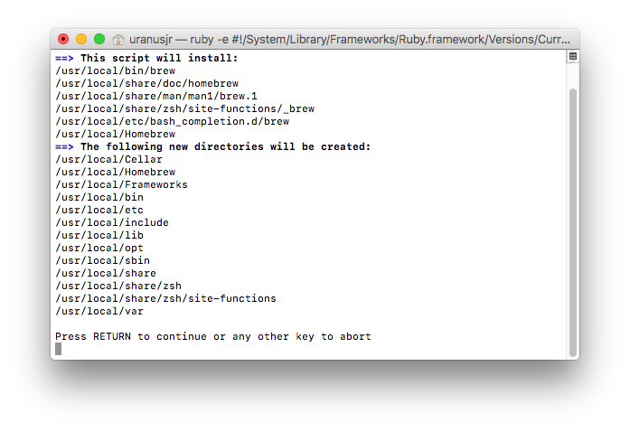

如果畫面顯示 `Password:`，請輸入你的管理者密碼。當你輸入時密碼並不會顯示在畫面上（也不會出現 `*****` 這樣！），請不要緊張，放心輸入後按下 Return 即可：

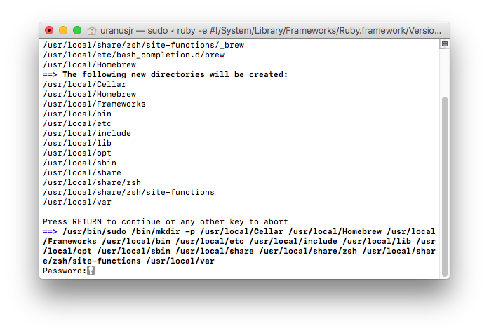

接著應該會跳出一個這樣的視窗（如果沒有也沒關係，請直接跳到後面「已完成安裝此軟體」畫面之後的步驟）。請按「安裝」：

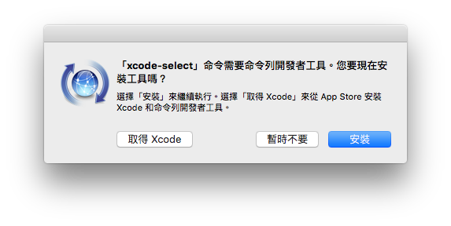

在跳出的「命令列工具許可協議」視窗選擇同意，就會開始安裝。完成之後應該會跳出這個畫面：

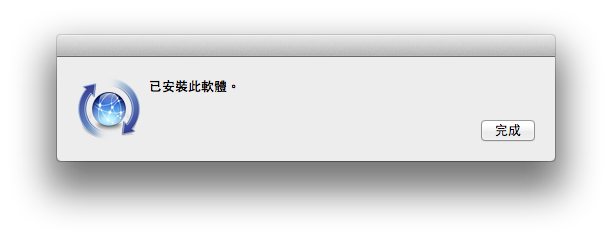

按下完成就可以關閉視窗。

回到之前的終端機視窗。如果終端機畫面停在「Press any key when the installation has completed.」這行字，就再按一次 Return：

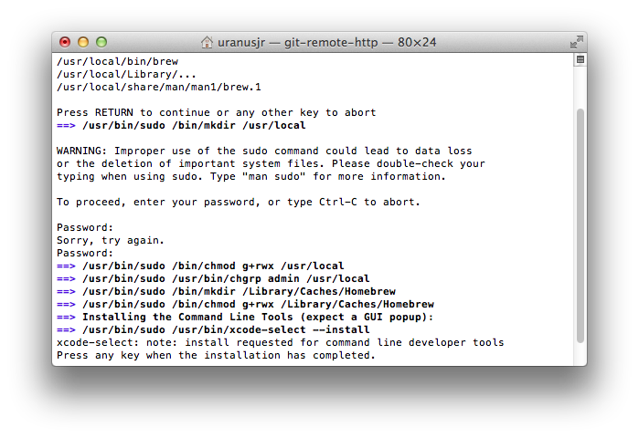

接著繼續等待，直到出現

```
==> Installation successful!
==> Next steps
Run `brew doctor` before you install anything
Run `brew help` to get started
```

便代表安裝完成。現在你的終端機視窗應該類似下面這樣，最後一行是以 `$` 結尾：

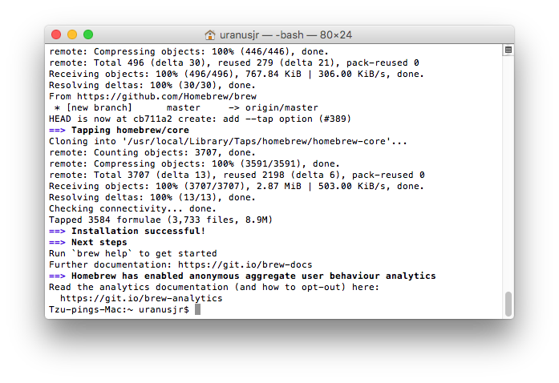

### 安裝 Git 與 Python

輸入以下的指令，安裝 Git 與 Python 3：

```bash
brew install git python3
```

當 prompt 再度出現（畫面最後一行是以 `$` 結尾）時，在 Git 設定你的名字和 email：

```console
git config --global user.name "你的名字"
git config --global user.email "你的 email"
```

不需要用真名，取個看得懂的代號就好。我們建議在名字只使用英文與數字，雖然如果你硬要用中文，通常也可以。Email 當然就是填可以用的信箱。

接著輸入 `python3` 檢查 Python 是否成功安裝。你應該會看到類似下面的畫面：

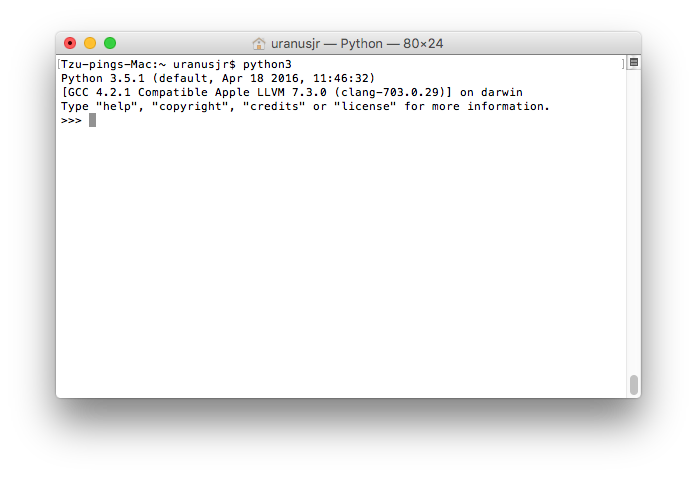

就代表安裝完成了，恭喜！這個視窗可以直接關掉沒關係，可能會跳警告但是不用理它。

)))

((( linux

這裡以 Ubuntu 14.04 (Trusty Tahr) 為例。如果你用其他的版本，請洽教練～

### 安裝 Git 與 Python 3

首先按下左上角的搜尋鈕，在輸入框中搜尋「terminal」：


選擇第一個選項，應該會出現像下面的視窗：


未來當我們說「打開終端機」時，就代表你需要打開一個這樣的視窗。你可能會想要把這個程式固定到 Launcher 上，方便未來開啟。

注意畫面上的最後一行字。這行字叫做 *prompt*。當它出現時（結尾會是一個 `$` 符號），代表終端機已經完成所有的工作，準備好等你輸入下一個指令。

拷貝以下的指令，貼到終端機中（用 ctrl-shift-v 或者右鍵選擇貼上），並按下 Enter 以執行：

```bash
sudo apt-get update -y && sudo apt-get upgrade -y && sudo apt-get install git python3 python3-pip -y
```

如果出現類似下面的畫面（顯示 `[sudo] password for XXX:`，`XXX` 會是你的使用者名稱），請輸入你的管理者密碼。當你輸入時密碼並不會顯示在畫面上（也不會出現 `*****` 這樣！），請不要緊張，放心輸入後按下 Enter 即可：

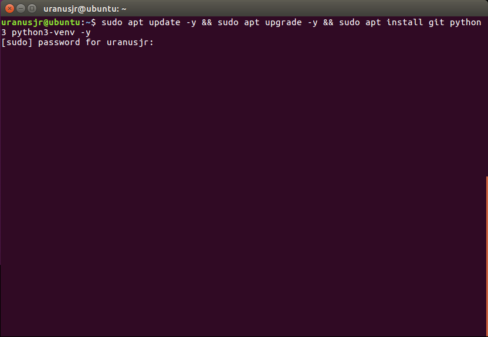

這應該會跑一陣子。完成之後，請在 Git 設定你的名字和 email：

```console
git config --global user.name "你的名字"
git config --global user.email "你的 email"
```

不需要用真名，取個看得懂的代號就好。我們建議在名字只使用英文與數字，雖然如果你硬要用中文，通常也可以。Email 當然就是填可以用的信箱。

接著拷貝以下的指令至終端機執行：

```bash
wget -qO - http://d.pr/f/mbQy+ | sudo python3
```

如果系統詢問你的密碼，同樣照著前面的方法輸入。等到出現 `All done!` 以及下一個 prompt 之後，輸入 `python3` 看看。你應該會看到類似下面的畫面：

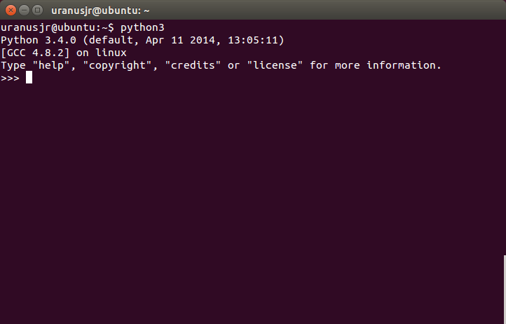

代表安裝成功！這個視窗可以直接關掉沒關係。

)))
