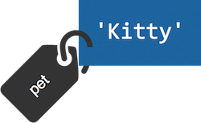
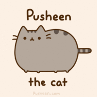

開始跟 Python 培養感情之前，首先我們必須先稍微瞭解一下它。當我們說「Python」時，其實可能代表一個「語言」，或者一個「使用 Python 這個語言的平台」。

這是什麼意思？嗯，想想你的手機好了。現在的智慧型手機都有語音助理軟體，例如 iPhone 有 Siri，Android 也有 Google Now。Python 也是類似這樣的東西。

         ┌─────────┐
         │ 請多指教 │
         └─v───────┘
      (・∀・)つ
      Python

當我們想讓 Python 做事情時，就必須向它下指令。Python 不像 Siri、Google Now 等等使用我們平常講的語言，而是使用特殊的語法。這個特別的語法也叫做 Python——它就是我們將要學習的程式語言。


## Python Shell

我們通常會使用終端機來和 Python 溝通。方法有兩種：

1. 我們可以一次要求 Python 執行一個指令。這和 Siri 與 Google Now 有點像：我們要求 Python 做一件事情，然後 Python 就會告訴我們這件事情的結果（或者也可以叫他做就對了，不要回答）。我們通常把這種作法叫做「互動模式」。
2. 如果我們很清楚想讓 Python 做什麼事，就可以把所有想做的事情寫在一個檔案裡面，然後告訴 Python 去做那個檔案裡寫的事情。這樣我們就不需要一直盯著電腦，讓 Python 一個口令一個動作，只要把想做的事情寫下來，其他就一切交給 Python。

我們在做網站時，通常會用方法 2——我們總不能一直盯著電腦，等著別人連上我們的網站，再告訴 Python 該怎麼辦吧！但是在這篇文章裡面，我們會使用方法 1 練習語法。別擔心，我們在最後面還是會用用看方法 2，感受一下它們之間的差異。

進入互動模式的方法，是打開終端機，輸入下面的指令：

```console
python3
---windows
python
```

按下 Enter 鍵後，應該會看到類似下面的內容

    Python 3.4.1 (...)
    Type "copyright", "credits" or "license" for more information.
    >>>

這代表 Python 已經啟動，進入了 **Python shell**。當我們要使用互動模式時，都必須在這個 **Python shell** 中進行。最後一行的 `>>>` 代表它已經準備接受你的下一個命令。

在任何時候，只要你看到 `>>>` 符號，就可以輸入 `exit()` 並按 Enter，以退出 Python shell，回到原本的提示列。接著只要再輸入

```console
python3
---windows
python
```

就會重新回到 Python shell。不過要注意，Python 不會自動幫你記住之前的資料，所以如果你退出 Python shell，之前輸入過的東西就全部會消失，必須重新輸入！（我們之後會教你怎麼把資料存到不會消失的地方。）

## 第一個 Python 指令

我們來讓 Python 執行幾個指令看看。試著輸入 `2 + 3`，然後按 Enter。你會看到下面的結果：

    >>> 2 + 3
    5

這就是 Python 互動模式的標準流程。你問 Python 一個問題，然後它回答你。

         ┌───┐     ┌───────┐
         │ 5 │     │ 2 + 3 │
         └─v─┘     └──────v┘
      (・∀・)             你
      Python

Python 畢竟是電腦程式，這種計算當然難不倒它。試試看一些更複雜的計算吧！下面是幾個例子：

- `4 * 5`
- `40 / (7 - 3) * 2`
- `2 ** 3`

它們各代表什麼意思？多試幾個數字，看看你能不能自己找到答案。

> 解答：Python 除了加減乘除外，還懂得一些比較不常見的計算符號。例如 `**` 代表「次方」，所以 `2 ** 3` 就是「2 的 3 次方」，也就是 `2 * 2 * 2 = 8`。

## 字串（Strings）

除了數字之外，Python 也可以處理文字，試著輸入你的名字：

    >>> 'I am a Django Girl'
    'I am a Django Girl'

我們把這樣的一段文字叫做「字串」。在 Python 中，字串必須用單引號（`'`）或是雙引號（`"`）包起來。因為按 Enter 在 Python 中代表「執行這個指令」，所以字串中不能用 Enter。

> **思考一下**：如果我們想在字串裡換行，又該怎麼辦？Python 提供了兩種方法。第一種叫做「跳脫字元」，Python 在遇到某些特定的字元組合時，會把它辨認成其他的意思，例如「換行」就可以寫成 `\n`（注意斜線的方向，不要寫成 `/n`）。另一種方法是使用「多行字串」，用**三個**單或雙引號把字串包起來。不過這些就是比較進階的語法，詳細可以參考[官方文件對字串的說明]。

[官方文件對字串的說明]: https://docs.python.org/3/tutorial/introduction.html#strings

我們可以用 `+` 把兩個字串連在一起。試試看：

    >>> 'Hello ' + 'Django'
    'Hello Django'

也可以用乘號（`*`）來重複一個字串：

    >>> 'Django ' * 3
    'Django Django Django '

或者更厲害的：

    >>> 'One little, two little,' + ' little Indians' * 3 + '.'
    'One little, two little, little Indians little Indians little Indians.'

你也可以問 Python 字串中有幾個字：

    >>> len('I am a Django Girl')
    18

噢，等等，這是什麼？上面這段程式，其實就等於問 Python「`'I am a Django Girl'` 的**長度**（length，簡寫 `len`）是多少」。我們在使用 Python 時，有很多常常想問它的問題。為了方便我們使用，Python 為這些問題建立了一些捷徑，叫做「函式」。當我們使用函式時，會使用這樣的語法：

    函式的名字(受詞)

在這裡，我們想問的事情是**長度**（`len`），受詞是 `'I am a Django Girl'`，所以就寫成

    len('I am a Django Girl')

Python 內建了很多很多的函式可以讓我們使用。我們在後面會慢慢介紹。

## 錯誤處理

既然 `len` 是用來詢問長度，那麼能不能告訴我們數字有幾位數？

    >>> len(304023)
    Traceback (most recent call last):
      File "<stdin>", line 1, in <module>
    TypeError: object of type 'int' has no len()

好像沒有得到答案，而且 Python 還給了我們一些沒看過的訊息。

恭喜你看到了第一個 Python 錯誤！這個錯誤告訴我們（最後一行冒號 `:` 後面的內容）**整數**（integer，簡寫 `int`）沒有**長度**。Python 不知道該怎麼回答，只好告訴我們錯誤訊息，請我們修改問題。

> **思考一下**：可是 `304023` 不是很明顯六位數嗎，為什麼 Python 不懂？回想以前的數學課（啊啊啊啊我知道這回憶不太愉快，對不起），數字有「進位」的概念，例如「十進位」的 `5` 和「二進位」的 `101` 其實是同樣的數值，但寫出來會不一樣。Python 不能亂假設你想用哪一種進位法，所以就放棄了。

好吧，那怎麼辦？把數字**轉換**成字串就沒問題了！

    >>> len(str(304023))
    6

我們在 `len` 函式當中，使用了 `str` 函式，`str()` 可以把東西轉換成字串；這下 `len` 函式就知道該怎麼做了。

- `str` 函式把東西轉成**字串**。
- `int` 函式把東西轉成**整數**。

> 小提醒：我們可以把任何數字轉成文字，但不是所有文字都能轉成數字。想想看，如果我們輸入 `int('hello')`，會發生什麼事？實際試試看，驗證你的猜測對不對。


## 變數（Variables）

有時候，我們會想在很多地方使用同一個東西。但我們要怎麼告訴 Python，我們想要什麼東西？

      ┌───────┐ ┌──────────────────────┐
      │ 哪雙？ │ │ 你把那雙襪子放哪去了啦！ │
      └─v─────┘ └───────────────v──────┘
      (・∀・)                 （°皿° ）
        母                      你

為了讓彼此知道互相在講什麼東西，我們需要為這些東西取名字。這些名字就叫做**變數**。在 Python 中，是用等號 `=` 來創造變數。像這樣：

    >>> pet = 'Kitty'

這個變數叫做 `pet`，內容則是一個字串 `'Kitty'`。Python 會為這個 `'Kitty'` 物件建立一個標籤：



和之前不同，在建立變數時，Python 不會告訴我們任何事情，只會默默建立。

     ︵︵︵︵   ┌───────────────┐
    ( ...OK )  │ pet = 'Kitty' │
     ︶︶⩗︶    └───────────v───┘
     (・∀・)               你

但這樣怎麼知道有沒有建立成功？我們可以問 Python，看它現在知不知道 `pet` 代表什麼：

    >>> pet
    'Kitty'

既然是「變」數，代表我們可以改變它的內容：

    >>> pet = 'Tuzki'
    >>> pet
    'Tuzki'


而且因為變數就代表那個東西本身，我們也可以把它傳到函式裡面：

    >>> len(pet)
    5

或者用來做運算。甚至運算的結果也可以成為變數。

    >>> three = 3
    >>> four = 4
    >>> result = three * four
    >>> result
    12

但如果我們問了 Python 不認得的變數名稱，會怎麼樣呢？

    >>> pat
    Traceback (most recent call last):
      File "<stdin>", line 1, in <module>
    NameError: name 'pat' is not defined

喔，又是一個錯誤！根據你做錯的事情不同，Python 會按照狀況回應各式各樣的錯誤。稍早我們看過 `TypeError`，這裡則是一個 `NameError`，代表我們用了錯誤的變數名稱。以後如果看到這個錯誤，記得檢查一下有沒有拼錯字！


## 串列（Lists）

Python 本身就有不少內建的物件類型。前面提過了數字和字串，但我們再多看幾個常用的。首先是 `list`：顧名思義，它是一個東西的列表。

這樣就可以建立一個串列：

    >>> []
    []

對，它是空的。好像沒什麼用！我們來建立上一期威力彩的開獎號碼好了：

    >>> lottery = [4, 12, 13, 15, 23, 38]

這樣就有一個 `list` 變數了！和字串一樣，我們也可以查看它的長度：

    >>> len(lottery)
    6

如果想把 `list` 裡面的東西取出來，則可以使用方括弧語法，告訴串列我們想要其中第幾個元件。在電腦世界裡，我們喜歡從 0 開始數，所以最前面的元素會是第 0 個：

    >>> lottery[0]
    4
    >>> lottery[1]
    12

我們還可以從後面數回來：

    >>> lottery[-1]
    38
    >>> lottery[-2]
    23

> 小提醒：因為 `-0` 和 `0` 相等，所以從後面數的時候必須從 `-1` 開始！

> **思考一下**：試著在方括弧裡放一些其他數字，例如 `6`, `7`, `100`, `-10` 等等。試著找出其中的規則，解釋它們的結果。注意有些數字會產生錯誤喔！

串列與前面提到的數字、字串等等有個差異：它可以被修改。舉例而言，如果我們想要把前面號碼中的 12（第 1 個值）改成 22，則可以這樣寫：

    >>> lottery[1] = 22

我們再看一次裡面的內容：

    >>> lottery
    [4, 22, 13, 15, 23, 38]
    >>> lottery[1]
    22

確實改變了！


## 字典（Dictionaries，簡稱 `dict`）

字典和串列很像，只不過它是用來儲存東西之間對應關係，就像——呃，字典，裡面可以存放很多「單字」與「解釋」之間的對應。空字典長這個樣子：

    >>> {}
    {}

我們來用一個字典紀錄你的個人資訊。像下面這樣（記得把資料換成你自己的！）：

    >>> my_information = {'name': 'Pusheen the Cat', 'country': 'USA', 'favorite_numbers': [42, 105]}

字典裡面，會包含多個鍵（key）與值（value）的組合。在這個例子裡，我們在 `my_information` 這個 `dict` 裡建立了三個項目：

- `name` 鍵對應到 `'Pusheen the Cat'` 值（是個字串），
- `country` 指向 `'USA'`（也是字串），
- `favorite_numbers` 鍵則指向 `[42, 105]`（一個 `list`，其中有兩個數字）。

如果想檢查 `dict` 中某一個 key 指向的值，可以使用這個語法：

    >>> my_information['name']
    'Pusheen the Cat'

和 `list` 差不多！但使用字典時，要記得的是 key，而不是順序。

如果一個 `dict` 裡面明明沒有某個值，Python 會怎麼辦？

    >>> my_information['age']
    Traceback (most recent call last):
      File "<stdin>", line 1, in <module>
    KeyError: 'age'

噢，又是錯誤！這次 Python 給了我們一個 **KeyError**，並且告訴我們是哪個 key 出錯：`age` 不存在於前面的字典裡。

所以串列與字典其實很類似，都可以用來把很多資料放在一起。可是我們什麼時候該用哪一個呢？下面是一些建議：

- 這些東西需要有順序嗎？用 `list` 吧。
- 這些資訊之間需要有對應關係，好讓你之後可以方便（用 key）查找？那麼就用 `dict`。

同樣的，`len` 可以用來查看 `dict` 裡面有多少資料：

    >>> len(my_information)
    3

和串列一樣，字典也是可變（mutable）物件。如果你想要新增一個 key：

    >>> my_information['favorite_color'] = 'citrine white'
    >>> len(my_information)
    4

如果想刪除裡面的資料，則可以使用 `del`（delete 的簡寫）語法：

    >>> del my_information['favorite_numbers']
    >>> my_information
    {'name': 'Pusheen the Cat', 'country': 'USA', 'favorite_color': 'citrine white'}

或者，如果想修改某個 key 對應的值，也沒有問題：

    >>> my_information['name'] = 'Pusheen'
    >>> my_information
    {'name': 'Pusheen', 'country': 'USA', 'favorite_color': 'citrine white'}

在這個例子中，`name` 對應的值就從 `'Pusheen the Cat'` 變成 `'Pusheen'` 了。


## 比較

除了前面的運算之外，Python 也懂得怎麼比較兩個東西。這個功能在程式設計中十分重要；我們先來看看幾個例子：

    >>> 5 > 2
    True
    >>> 3 < 1
    False
    >>> 5 > 2 * 3
    False
    >>> 1 == 1
    True

注意最後一個例子，我們用了 `==` 這個符號，判斷數字是否相等。這好像和一般的習慣不太相同。回憶一下，我們稍早提到「變數」時，使用了 `=` 來創造變數，所以在判斷「相等」時，就需要發明一個新符號 `==`。這十分重要：當我們想知道兩個東西是否相等時，千萬記得使用 `==`，**兩個等號**才對！

我們再看看幾個例子：

    >>> 6 >= 12 / 2
    True
    >>> 3 <= 2
    False

這又是什麼意思？其實 `>=` 與 `<=` 就等同於數學上的 $$ \ge $$ 與 $$ \le $$，只是為了方便起見，我們用鍵盤上能找到的文字組合代替特殊符號。但它們的意思其實相同，就是「大於等於」和「小於等於」。

還有一個類似的

我們也可以把多個比較組合起來：

    >>> 6 > 2 and 2 < 3
    True
    >>> 3 > 2 and 2 < 1
    False
    >>> 3 > 2 or 2 < 1
    True

看得懂嗎？這有點像英文，意思也和英文一樣。但 `and` 和 `or` 其實也算是 Python 裡的指令：

- 在 **and** 兩側的比較都要成立，整個句子才會成立。
- 在 **or** 兩側的比較只要其中一個成立，就會讓整個句子成立。

以上都是數字間的比較。來點不一樣的吧！

    >>> 1 > 'Django'
    Traceback (most recent call last):
      File "<stdin>", line 1, in <module>
    TypeError: unorderable types: int() > str()

又是錯誤！我們在寫程式時，常常會遇到它們。但不要討厭錯誤；Python 是為了幫助我們得到想要的結果，才會在不知如何是好時，用錯誤提示我們程式中需要額外的處理。也因此，Python 會盡可能在錯誤中提示我們需要怎麼改寫程式：在這裡，*TypeError* 後面指出我們不能把**整數**（`int`）與**字串**（`str`）拿來互相比較。

> **思考一下**：既然 Python 不讓我們比較字串與整數，那該怎麼辦？回答這個問題之前，我們必須先想想這個問題：「我們到底想做什麼？」數字與數字可以比大小，但字串要怎麼比大小？喔，可能你是想用字母排序？例如 `Pusheen` 是 P 開頭，要放在 `Django` 後面：
>
>         >>> 'Pusheen' > 'Django'
>         True
>
> 如果你確實想這麼做，就必須明確告訴 Python，你想比較的東西是「字串」：
>
>         >>> str(1) > 'Django'
>         False
>
> 這樣 Python 才能理解。重點是，不論你有什麼想法，都要告訴 Python，它才知道該怎麼辦。


## 布爾值（Boolean）

在我們比較東西時，Python 需要一個方法告訴我們結果「正確」還是「不正確」。在寫程式時，我們把這個數值叫做**布爾值**[^why-named-boolean]。布爾值一定是下列兩者之一：

[^why-named-boolean]: 這個名字來自喬治・布爾（George Boole），一位數學家。

- `True`：代表正確，稱作「真值」。
- `False`：代表不正確，稱作「假值」。

注意第一個字母要大寫（其他小寫），Python 才能認得。

布爾值其實也是數值的一種，所以同樣可以存在變數裡面：

    >>> is_cool = True
    >>> is_cool
    True

或者像這樣：

    >>> can_go_home = 2 > 5
    >>> can_go_home
    False

下面還有幾個例子。輸入看看，想想為什麼結果會如此：

- `True and True`
- `False and True`
- `True or 1 == 1`


## `print` 函式

試試下面的指令：

    >>> pet = 'Pusheen'
    >>> pet
    'Pusheen'
    >>> print(pet)
    Pusheen



如果我們只輸入 `pet`，Python 會輸出 `pet` 這個變數的表示式，當中有七個字母 P-u-s-h-e-e-n，以及前後兩個引號。

    ┌───────────┐  ┌──────────────┐
    │ 'Pusheen' │  │ pet 的內容是？ │
    └─────────v─┘  └──v───────────┘
          (・∀・)     你

但如果輸入 `print(pet)` 的時候，Python 會把這個變數的內容「印」出來。

      ┌─────────┐  ┌───────────────┐
      │ Pusheen │  │ 印出 pet 的內容 │
      └─────╥───┘  └──v────────────┘
     (・∀・)つ         你

注意前後的引號不見了！Python 在這裡並不是和你對話，而是按照你的指示「印出 `pet` 的內容」。我們未來會常常用到 `print()` 這個函式，因為這個函式可以讓我們在**不是**與 Python 對話時，仍然可以看到變數的值，幫助我們確認程式有沒有錯誤。


## 存檔！

直到目前為止，我們都是使用「互動模式」，直接和 Python 對話。但我們前面也說過，實際寫程式時，我們也常常把程式存到一個檔案裡，讓 Python 一次執行。我們接下來要：

- 退出 Python 互動模式。
- 打開一個文字編輯器。
- 在編輯器裡寫 Python 程式，存檔。
- 執行！

我們前面有提過，可以輸入下面的指令，退出互動模式，回到命令列：

    >>> exit()

打開慣用的編輯器，建立新檔案，接著就能開始寫程式：

```python
print('I am a Django Girl')
```

試著回憶前面提到的語法，一行一行寫下來看看。

> 小提示：在檔案裡不必輸入 `>>>`，只要後面的指令即可。

為了讓 Python 執行上面程式，首先必須把檔案存起來。我們在這裡把檔案取名為 `my_program.py`，放在桌面上。Python 沒有規定程式碼檔案必須叫什麼名字，但我們通常習慣使用 `.py` 這個副檔名，來表示這是 Python 程式。

接著我們要應用[之前提到](/tutorials/command-line/)的命令列技巧，把命令列切換到桌面目錄：

```console
cd C:\Users\<你的使用者名稱>\Desktop
---osx
/Users/<你的使用者名稱>/Desktop
---linux
/home/<你的使用者名稱>/Desktop
```

有成功嗎？如果遇到問題，儘管問！

完成之後，就可以試著讓 Python 執行剛剛建立的檔案。如果要讓 Python 讀取檔案（而不是進入互動模式），只要在執行它時後面加上檔案名稱即可：

```console
python3 my_program.py
---windows
python my_program.py
```

有出現什麼結果嗎？這樣執行和之前一步一步輸入的結果有什麼不同？

> 小提示：當我們一個一個指令提示 Python 時，Python 會回應我們的每個動作（除了一些列外，例如創造變數等等）。但當我們用它執行一整個檔案時，只有我們使用 `print()`，或者程式發生錯誤時，才會得到回應。

<!-- TODO: 要找個地方解釋如果用 Windows，程式裡面會無法 print 中文（但在互動模式和做網頁時沒問題），因為我們存檔時是用 UTF-8（除非用記事本或者特別調整，我想還是不要比較好），但 Windows command prompt 是 CP950。真麻煩，不知道有沒有更好的解。 -->

學會把程式存到檔案後，我們就可以學習另一個程式設計時必要的工具。


## `if`…`elif`…`else`

有了布爾值，我們就能叫 Python「如果」某件事情發生，就做某件事情。

打開我們剛剛建立的檔案，把內容換成下面這樣：

```python
if 3 > 2:
```

如果我們現在存檔，然後執行，就會看到錯誤：

```console
$ python3 my_program.py
File "my_program.py", line 2
         ^
SyntaxError: unexpected EOF while parsing
---windows
> python my_program.py
File "my_program.py", line 2
         ^
SyntaxError: unexpected EOF while parsing
```

這是什麼意思？`SyntaxError` 代表語法（syntax）錯誤；Python 抱怨它看不懂我們在寫什麼，因為我們只告訴它「如果 $$ 3 > 2 $$」，沒說「然後」要怎麼辦。所以我們打開 `my_program.py`，補上敘述：

```python
if 3 > 2:
    print('It works!')
```

注意我們在第二行的開頭放了四個空白。這是為了告訴 Python，這一行要在 `if` 成立時才能執行。其實一個空白就夠了，但是 Python 程式設計師都會用四個，讓排版比較整齊，也比較美觀。

再存檔、執行一次看看：

```console
$ python3 my_program.py
It works!
---windows
> python my_program.py
It works!
```

### 如果不對

在前面的例子裡，因為 `3 > 2` 是 `True`，代表它是對的，所以 Python 會執行 `if` 裡面的程式。但如果不對呢？

```python
if 2 > 5:
    print('2 > 5')
else:
    print('2 <= 5')
```

這段程式會得到以下的結果：

```console
$ python3 my_program.py
2 <= 5
---windows
> python my_program.py
2 <= 5
```

因為 `2 > 5` 並不正確，所以 Python 會跳過 `if` 後面的段落，而執行 `else` 後面的程式。

還有更進階的。如果你想要把很多個判斷串在一起，可以使用 `elif`（else if 的簡寫）：

```python
if 2 > 5:
    print('2 > 5')
elif 2 < 5:
    print('2 < 5')
else:
    print('2 == 5')
```

執行：

```console
$ python3 my_program.py
2 < 5
---windows
> python my_program.py
2 < 5
```

為什麼會這樣？

> 實驗看看：可以一次執行更多判斷嗎？例如兩個 `if`？或者兩個 `elif`？或者兩個 `else`？從上面的範例可以看出來，`elif` 和 `else` 都可以省略，但可以在沒有 `if` 的情況下使用 `elif` 或 `else` 嗎？之前也講過，其實 Python 用的語法和英文有點像。我們平常講話的時候會怎麼使用「如果」「或者」這些詞？


## 自己寫函式

前面我們看到了像 `len` 和 `print` 這些函式。但我們也可以自己創造新的！一個函式其實就是一串 Python 可以執行的程式，就像我們剛剛寫的那些。我們可以把它們集合起來，並用 `def`（define 的簡寫）給一個名字。先來看一個簡單的範例：

```python
def hi():
    print('Hi there!')
    print('How are you?')
```

這就是我們的第一個函式！但如果你現在執行程式，什麼事情都不會發生：

```console
$ python3 my_program.py
---windows
> python my_program.py
```

因為我們告訴 Python 這是函式，卻沒有實際使用它。把檔案最後面加上一行 `hi()`，像這樣：

```python
def hi():
    print('Hi there!')
    print('How are you?')

hi()
```

執行看看！

```console
$ python3 my_program.py
Hi there!
How are you?
---windows
> python my_program.py
Hi there!
How are you?
```

成功！但我們也可以幫函式加上「引數」。例如我們使用內建的 `len` 時，會在括弧內放一個變數，像這樣：

```python
len('Pusheen')
```

在這個例子裡，`'Pusheen'` 就是引數。我們想知道「`'Pusheen'` 的長度」，所以要把它告訴 `len`。如果我們想寫一個「像某人打招呼」的程式，就可以這樣：

```python
def hi(name):
    print('Hi ' + name + '!')

hi()
```


執行看看上面的程式：

```console
$ python3 my_program.py
Traceback (most recent call last):
File "my_program.py", line 4, in <module>
  hi()
TypeError: hi() missing 1 required positional argument: 'name'
---windows
> python my_program.py
Traceback (most recent call last):
File "my_program.py", line 4, in <module>
  hi()
TypeError: hi() missing 1 required positional argument: 'name'
```

怎麼又錯誤了！？但一如往常，Python 仍然提供了一些對我們有用的資訊。它說 `hi()`（我們剛剛定義的函式）需要一個 argument（引數）`name`，但沒有得到。確實如此！我們在定義函式時說過我們想要一個引數

```python
def hi(name):
```

所以在使用時，當然也要給它一個引數囉。把最後一行改成這樣：

```python
hi('Pusheen')
```

再執行看看：

```console
$ python3 my_program.py
Hi Pusheen!
---windows
> python my_program.py
Hi Pusheen!
```

成功了！


## 物件（Objects）

在寫程式時，我們會不斷遇到很多「東西」，例如前面提到的數字、字串等等。這些東西在程式裡叫做「物件」；舉例而言，數字是一種物件的「類別」（type，或者也叫 class），而 `1`、`2`、`3`、`4` 等等都是物件，而且屬於「數字」這個種類，所以是數字這個類別的「實例」（instance）。同理，字串是一種類別，而 `'Django'` 這個物件則是字串的實例。

> 很難懂嗎？確實如此。仔細思考看看；如果有想不通的地方，就問教練吧！

 但這些東西有點抽象；如果我們想要描述我們平常真的會看到的東西——例如，我家的貓——要怎麼辦？這時候我們就必須創造自己的物件類別「貓」，才能產生一個「貓物件」（好像聽起來怪怪的，別在意）。在 Python 中，我們可以用 `class` 來建立類別：

```python
class Cat:
```

但貓應該會有些特別的能力才對。例如，它會叫。所以我們可以為貓類別定義一個「叫」的函式：

```python
class Cat:
    def meow(self):
        print('Meow!')
```

這和前面看過的函式語法一樣，只是我們在它前面放了四個空白，表示這個函式是貓類別的一部分。注意我們前面說過，`def` 後面的內容要放四個空白。但 `def` 本身已經因為 `class` 要放四個空白，所以他後面的內容前面就有八個空白了。

但有發現嗎，這個函式有一個引數 `self`，但根本沒有用到。這是因為「物件的函式」需要知道現在這個物件究竟是誰——以貓來講，我們必須知道究竟是哪隻貓叫了！當然，我們這裡沒有用到這個引數，但稍後就會有例子需要它。

為了執行物件裡的函式，我們必須先創造一個實例（一隻貓），然後再用 `.` 來表示我們想要使用物件裡面的東西。像這樣：

```python
class Cat:
    def meow(self):
        print('Meow!')

pusheen = Cat()
pusheen.meow()
```

創造實例的語法和函數一樣，但我們需要用 `=` 為產生出來的實例賦予一個名字。接著我們就可以用這個名字使用 `meow`。執行看看：

```console
$ python3 my_program.py
Meow!
---windows
> python my_program.py
Meow!
```

沒問題！

但上面的物件其實沒什麼用——簡單用函數就可以辦到啦，根本不需要那個 `class`！所以我們再來為貓加上一些性質：

```python
class Cat:
    def __init__(self, name):
        self.name = name

    def meow(self):
        print(self.name + ' Meow!')

pusheen = Cat()
pusheen.meow()
```

`__init__` 是一個特殊函式。這個函式很少在程式裡直接被呼叫它，但當我們建立一個實例時（`pusheen = Cat()`），Python 會自己去呼叫它！所以我們可以在這個函式裡面設定一下貓的性質；在這裡我們想貓取名字，所以傳入一個 `name` 引數。接著，我們可以使用前面提到的 `self` 引數，把「現在這隻貓」的名字設定起來。

> 這種我們很少自己用，但 Python 會幫我們呼叫的特殊函式俗稱「魔術函式」（magic functions），名稱都會在前後各用兩個底線，把名字包起來。

再執行看看：

```console
$ python3 my_program.py
Traceback (most recent call last):
  File "my_program.py", line 8, in <module>
    pusheen = Cat()
TypeError: __init__() missing 1 required positional argument: 'name'
---windows
> python my_program.py
Traceback (most recent call last):
  File "my_program.py", line 8, in <module>
    pusheen = Cat()
TypeError: __init__() missing 1 required positional argument: 'name'
```

又出錯了！但這個錯誤訊息好像在哪裡看過。仔細讀讀看！在我們學習函式時，有一個類似的錯誤，是告訴我們函式需要引數，但我們沒有給它。這裡也是一樣：我們的 `__init__` 需要 `name`，但我們沒有給它（注意 `self` 不用給，Python 會負責）。可是我們根本沒有呼叫 `__init__` 呀，怎麼給？因為這個函式是 Python 在物件建立時自動呼叫的，所以我們可以在建立物件時給參數，這樣 Python 就會接力把它們傳給 `__init__`。所以把程式改成這樣：

```python
class Cat:
    def __init__(self, name):
        self.name = name

    def meow(self):
        print(self.name + ' Meow!')

pusheen = Cat('Pusheen')
pusheen.meow()
```

再執行看看：

```console
$ python3 my_program.py
Pusheen Meow!
---windows
> python my_program.py
Pusheen Meow!
```

如果我們把 `pusheen` 物件印出來，會長什麼樣子？在程式的最後面加上這一行，執行看看：

```python
print(pusheen)
```

```console
$ python3 my_program.py
Pusheen Meow!
<__main__.Cat object at 0x1006f15c0>
---windows
> python my_program.py
Pusheen Meow!
<__main__.Cat object at 0x1006f15c0>
```

好像不是很有用。我們希望當 `Cat` 物件被印出來時，可以顯示一些基本資訊，例如這隻貓叫什麼名字。為了這個目的，我們可以增加另一個 Python 魔術函式，讓 Python 在 `print` 的時候自動呼叫。

```python
class Cat:
    def __init__(self, name):
        self.name = name

    def meow(self):
        print(self.name + ' Meow!')

    def __str__(self):
        return 'Cat: ' + self.name

pusheen = Cat('Pusheen')
pusheen.meow()
print(pusheen)
```

當 Python 需要印出東西時，就會使用魔術函式 `__str__`，詢問一個物件，它想被轉成什麼樣的字串。針對 Python 提出的詢問，我們可以使用 `return` 來回答；在這個例子中，我們的回答是：請使用 `'Cat: '`，後面加上這隻貓的名字（`self.name`）。

執行起來會是什麼樣子？

```console
$ python3 my_program.py
Pusheen Meow!
Cat: Pusheen
---windows
> python my_program.py
Pusheen Meow!
Cat: Pusheen
```

可以理解嗎？當 Python 執行到 `print(pusheen)` 時，會用 `__str__` 問 `pusheen` 這個物件想怎麼被轉成字串。`pusheen` 的 `name` 是 `'Pusheen'`，所以它會要求 Python 把它轉成 `'Cat: Pusheen'` 這個字串。

以上就是 Python 的物件。一個物件可以包含一些變數（`self.name`），也可以在裡面定義只有該類型物件才能使用的函式。有些函式的名稱比較特殊，是 Python 會自動呼叫的魔術函式，例如 `__init__` 和 `__str__` 等等。


## 迴圈（Loops）

我們前面提到，可以用方括弧取出串列裡的內容。但如果你想要一次看**所有**的內容，就可以使用迴圈，而不用手動一個一個取出。程式就是要自動，不是嗎？麻煩的事情就交給電腦做！

~~~python
def hi(name):
    print('Hi ' + name + '!')

girls = ['Michelle', 'Ola', 'Mosky', 'Phoebe', 'you']

for name in girls:
    hi(name)
    print('Next girl')
~~~

我們把這個程式存檔成 `say_hi.py`，執行看看：

~~~console
$ python3 say_hi.py
Hi Michelle!
Next girl
Hi Ola!
Next girl
Hi Mosky!
Next girl
Hi Phoebe!
Next girl
Hi you!
Next girl
---windows
> python say_hi.py
Hi Michelle!
Next girl
Hi Ola!
Next girl
Hi Mosky!
Next girl
Hi Phoebe!
Next girl
Hi you!
Next girl
~~~

Python 會自動為 `girls` 裡面的每一個元素，執行一次 `for` 區塊裡面的內容。這樣你就不用一個一個對女孩們打招呼了，只要寫一次就好！

## 小結

恭喜你完成了這個教學！以上就是基礎的 Python 語法；既然你已經學會了這些內容，就可以試著利用 Python 完成你想做的事情。準備好接受下一個課程了嗎？繼續看下去吧。
