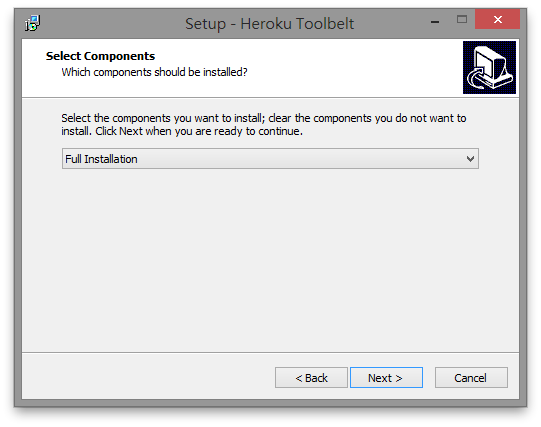
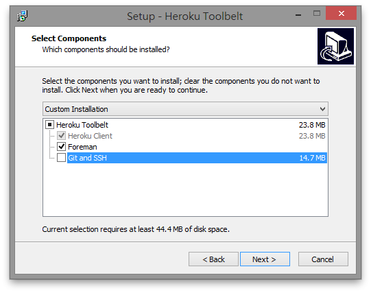
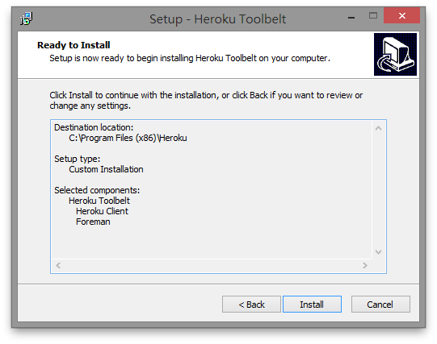

當你的網站完成後，我們必須找個公開的地方來放它，才能讓它被全世界(!)看到。不過在那之前，我們必須先設定一下。在這個教學中，我們會帶領你設定 **[Heroku](http://heroku.com/)** 這個專門讓你放置網站的服務。接著在你完成網站後，我們會教你怎麼使用它。


## 註冊 Heroku 帳號

首先我們要註冊一個帳號。前往 <https://id.heroku.com/signup/www-header>，輸入你的 Email 信箱，然後點選「Sign Up」按鈕。

稍等幾分鐘後，去你輸入的信箱收信。你應該會收到一封像這樣的 Email：


點選第二行的連結後，應該會出現一個網頁。請在「Password」與「Confirm Password」輸入密碼後，按下 Save 完成註冊。

> 如果你把下面的框框打勾，Heroku 就會寄一些活動廣告給你。勾不勾都可以。

按下 Save 後等一陣子，直到「A moment please」消失後，就代表註冊完成！


## 安裝 Heroku 工具

接著要安裝 Heroku 工具，好讓我們能在命令列使用 Heroku。

((( windows

點選[這個連結](https://toolbelt.heroku.com/download/windows)下載安裝程式，並雙擊執行。如果出現「不明發行者」的警告視窗，請直接按「是」繼續執行。進入安裝程式後一直按「Next」，直到看見這個畫面：



請把「Full Installation」改成「Custom Installation」，然後在出現的方塊中把「Git and SSH」**取消勾選**，像這樣：



按下「Next」，來到這個畫面：



接著按「Install」直接開始安裝。完成後會看到這個畫面：


按下「Finish」，完成安裝。

)))

((( osx linux

打開終端機，輸入以下指令安裝 Heroku 工具程式：

```console
sudo apt-get install heroku-toolbelt
---osx
brew install heroku-toolbelt
```

)))

## 設定 Heroku 工具

在終端機內輸入以下指令：

```console
heroku login
```

接著依照指示，輸入你剛剛用來註冊 Heroku 的 Email 與密碼。注意輸入密碼時不會顯示！

如果你看到類似這樣的文字：

```
Your Heroku account does not have a public ssh key uploaded.
Found an SSH public key at C:/Users/Tzu-ping Chung/.ssh/id_rsa.pub
Would you like to upload it to Heroku? [Yn]
```

請按一次 enter。

如果你看到下面這行字：

```
Authentication successful.
```

並且回到 prompt，就代表設定成功了！

> 你的信箱可能會收到一封標題是「Key added to your Heroku account」的信。這是正常的！因為我們是第一次在這台電腦登入 Heroku，所以它需要確認這台電腦確實屬於你。反過來說，如果哪天你沒用新電腦登入，卻收到這封信，可能就要問一下 Heroku 出了什麼事囉！