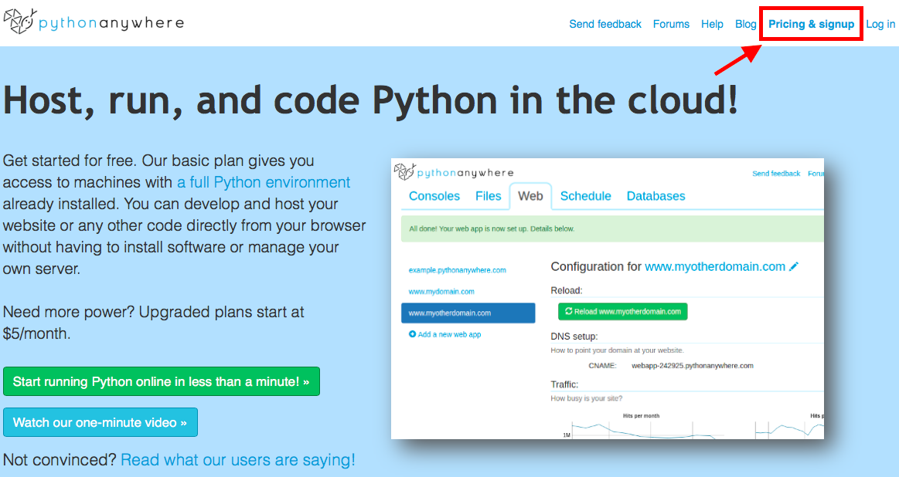
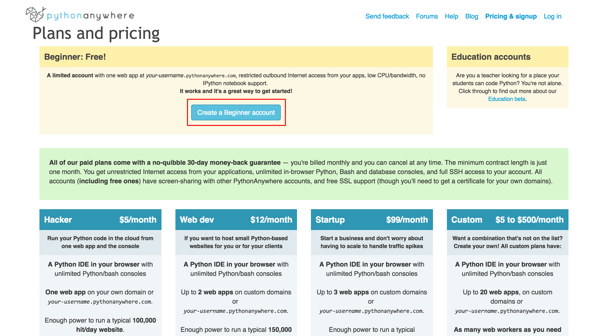
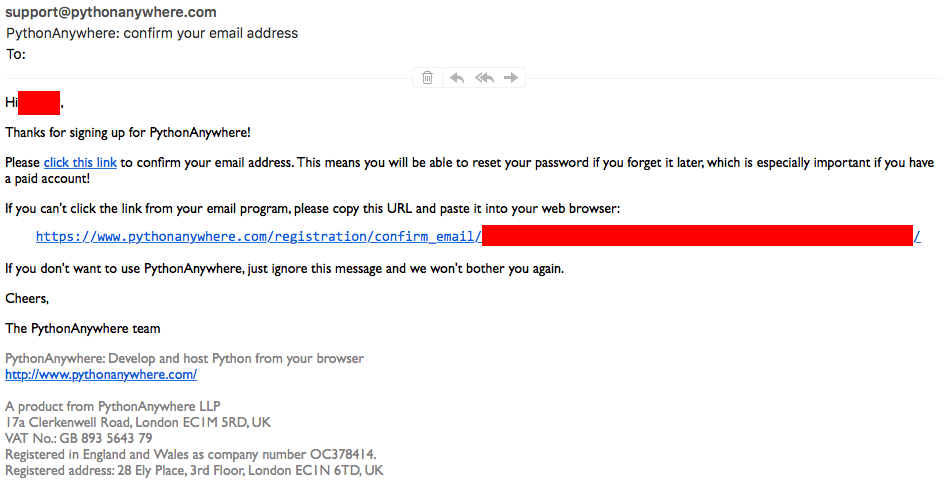

當你的網站完成後，我們必須找個公開的地方來放它，才能讓它被全世界(!)看到。不過在那之前，我們必須先設定一下。在這個教學中，我們會帶領你設定 **[PythonAnywhere](https://www.pythonanywhere.com)** 這個在雲端執行 Python 程式的服務。

## 註冊 PythonAnywhere 帳號

前往 PythonAnywhere 的首頁 <https://www.pythonanywhere.com>，點擊右上角的 **Pricing & Signup**。

按下左上角 **Beginner: Free!** 框框裡的「Create a Beginner account」按鈕。

在出現的表單內填上你想要的使用者名稱、密碼、以及綁定的 Email 帳號。把最下面的「I agree to the Terms and Conditions」打勾，然後按下「Register」按鈕。

稍等幾分鐘後，去你輸入的信箱收信。你應該會收到一封像這樣的 Email：

按下第二段的「click this link」，即可完成註冊。
