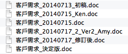
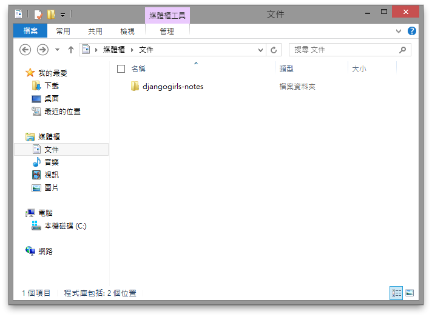
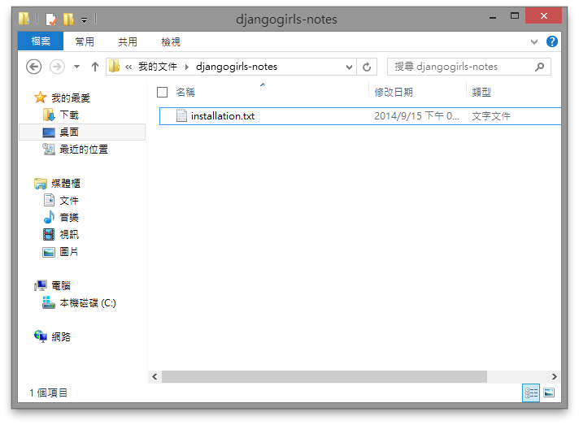

你可能聽說過版本控制。即使你沒聽說過，應該也用過。嗯？你問我這怎麼可能？

你應該有這種檔案吧？



其實這就是啦！版本控制的意思，就是記錄某（些）檔案的變化，讓你可以在未來隨時調閱某個時候的文件狀態。

所以其實你已經會版本控制了。那這個教學的意義究竟是⋯⋯？


## 版本控制系統

延續剛剛的例子。手動管理版本直覺又簡單，但你可能遇過這些問題：

1. 要怎麼知道 Amy 在 7 月 17 號改了什麼？把前後兩份文件都打開對照著看囉。如果 Amy 有經驗，或許會用不同顏色來標注他新增的內容。但如果某個 **1** 被改成 **2**，好像就很容易漏掉。
2. 如果你想再修改「決定版」，應該要怎麼做？打開它，**先另存新檔**，再開始修改。不然原本的決定版就會被你覆蓋掉。可是好像偶爾會忘記，然後就只好拼命憑印象還原。:(
3. 咦？我記得 7 月 16 號好像還有一版不是嗎？放到哪裡去了⋯⋯啊！原來我丟錯目錄了！

我們都會犯錯。版本控制系統（version control system，簡稱 VCS）可以讓電腦自動幫我們做一些記錄與管理的工具，用來避免自己一時手滑造成錯誤。本章會教你如何使用一款叫做 Git 的版本控制系統，讓你用簡單幾個指令新增、管理版本，並藉由常見的網路服務備份、共享、同步資料。它還有很多很多其他功能，但我們先從簡單的開始！


## 建立一個 Git 檔案庫

在 Git 裡，是用**檔案庫**（repository）來代表一個被管理的檔案集合。檔案庫會是一個目錄，其中可以包含任意的子目錄與檔案。

我們來建立一個檔案庫，用來筆記我們在 Django Girls 學到的東西。首先建立一個目錄，來存放所有檔案：



我們推薦檔案庫名稱只用英文、數字、橫線（`-`）和底線（`_`）。裡面的檔案和子目錄就沒有這個限制，因為 Git 其實也可以處理中文檔名；但在終端機裡打中文不是很方便，所以我們通常還是會用英文。

我們在目錄裡建立一個檔案，存放我們之前[安裝開發環境](/tutorials/installation/)時學到的東西：



你可能習慣用 Word 或者其他軟體來寫，而不是用 TXT。不過這些文件要另外設定，才能被 Git 處理。而這些設定有點超出本教學的範圍，所以我們這裡只使用 Git 預設可以處理的格式。如果你想知道 Git 怎麼處理非純文字文件，可以參閱[這篇文章](http://git-scm.com/book/zh-tw/Git-客製化-Git-屬性)，或之後詢問教練。:)

總之，我們現在有個目錄，裡面有一份文件。接著我們要用指令要求 Git 管理這個目錄。打開終端機，進入 `djangogirls-notes` 這個目錄，然後輸入以下指令：

```console
git init
```

> 小技巧：你可以直接把圖形介面裡的檔案夾拖到終端機裡，就會自動輸入那個檔案夾的路徑。可以省掉一些打字時間！

輸入上面的指令後，你應該會看到類似下面的訊息：

```
Initialized empty Git repository in /Users/uranusjr/djangogirls-notes/.git/
```

代表 Git 已經知道要負責管理這個檔案庫。


## 把檔案加入檔案庫

用以下的指令，把剛剛的檔案加進檔案庫：

```console
git add .
```

注意 `add` 後面那個點！

接著用 `commit` 告訴 Git 我們要建立一個新版本：

```console
git commit -m "Initial commit"
```

Git 可以為每個版本加上一個註記，讓你在未來可以知道每個版本改了什麼東西。以上面的例子而言，這個版本的註記就是 **Initial commit**。這只是個範例，實際上你想在這裡寫什麼都可以！（不過要記得用引號 `"` 包起來。）


## 總結

Git 是個博大精深的軟體，裡面包含了非常多功能。不過只要學會 `init`、`add`、`commit`，就可以得到許多好處。如果你有興趣，可以參閱免費的 [Pro Git 電子書（中文版！）](http://git-scm.com/book/zh-tw/)。但即使不看，你現在學會的也已經很好用了！

下面的表格整理了常用的 Git 指令：

指令語法             | 說明
--------------------|--------------------------
`git init`          | 在目前目錄建立 Git 檔案庫
`git add <檔案>`     | 把 `<檔案>` 加入檔案庫。`git add .` 可以一次加入全部檔案。
`git commit -m <註記>` | 加入一個版本。
`git status`        | 查看目前的檔案庫狀態。
`git diff`          | 查看目前檔案庫和上個版本之間的差異。
`git log`           | 查看版本記錄。
